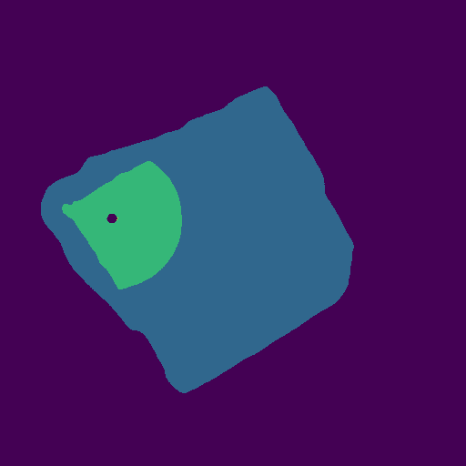

# Analyzing Ballpark Features from Satellite Imagery

## Overview

This project aims to apply computer vision techniques to extract and analyze features of baseball fields from satellite images. The primary objective is to train a model to automatically identify key features of a baseball field and measure its boundary in feet. These measurements can then be used in a variety of analytical applications, including data visualizations and park factor estimations, as demonstrated in this project.

## Project Components

### 1. Data Collection

The first step in training a computer vision model is collecting a set of images. For obtaining satellite images of baseball fields, I chose to use ArcGIS due to its focus on geospatial data analysis, which provides more flexibility for data-driven applications and fewer usage restrictions. Using Python Selenium, I built an automation to visit [ArcGIS's Map Viewer](https://www.arcgis.com/home/webmap/viewer.html) and collect data. Using a geographic coordinate as its input, this automation focuses the map on the baseball field, measures the diagonal of the map in feet, and takes a screenshot of the map.

With this automated, I was then able to create a set of field images by handpicking fields and finding their coordinates. I wanted a diverse dataset with fields ranging from professional ballparks to local parks, and I ended up with 129 images of fields.

With these images serving as inputs, I then needed to produce targets for my model. Using [Labelme](https://www.labelme.io/), I annotated the field boundary, infield, and pitcher's mound of each image in my dataset.

### 2. Field Segmentation with Computer Vision

In order to produce segments from baseball field images, I chose to use a U-Net architecture with a ResNet-34 encoder backbone which has been pretrained on ImageNet data. Using PyTorch's U-Net implementation and [Kaggle Notebook's](https://www.kaggle.com/docs/notebooks) GPU resources, I began training. I decided to only use 7 images as my test set, selecting fields from different playing levels. I opted for a small test set due to the limited size of the overall dataset. This was done to ensure that the model would have sufficient data to learn from in the train set. Using cross-entropy loss, training resulted in a train loss of 0.0094 and a test loss of 0.0575.

The following images show model outputs of images from the test data set:

#### Dodger Stadium (34.073824, -118.23999)

#### Coors Field (39.756062, -104.994178)

#### Fenway Park (42.346676, -71.097218)

#### McCann Baseball Field (41.717796, -73.933767)

#### Louisville Slugger Field (38.256737, -85.744433)

#### Dunkin Park (41.771544, -72.673693)

#### Hotto Motto Field Kobe (34.680718, 135.073591)

### 3. Geometric Feature Extraction

For this project, feature extraction involves applying some corrections, determining the orientation of the field, and converting the field boundary from a segment to dimensions in feet. The corrections involve functions such as filling in a missing pitcher's mound and removing extraneous segments.

The algorithm to determine field orientation from segments combines a few different strategies. First, it finds the centerpoint for each of three segments: the pitcher's mound, the infield (including the pitcher's mound), and the entire field (including the infield and pitcher's mound). Using these three centerpoints, it calculates three direction vectors. An initial estimation of the orientation is provided by calculating the unit vector of each direction vector and finding the sum of unit vectors. After rotating the segments based on the initial estimation, some additional features are used to refine the estimation, including the basepaths and the outfield corners.

Following this estimation, the segments are rotated and converted to a 2-dimensional polygon. The diagonal measurement from data collection is used to convert from pixels to feet, and the mound center is placed at the coordinate (0, 60.5), meaning that (0, 0) is home plate. Once the location of home plate is determined, more adjustments are applied to the orientation. The field is aligned so that each foul line intersects the boundary between the outfield corners. This prevents the error in orientation from being great enough to cause the foul lines to intersect with a boundary that is truly in short foul territory. This final adjustment provides the set of vertices represented the estimated field boundary.

### 4. Park Factor Estimation

One potential use for field boundaries is estimating park factors. This is currently a work in progress. My approach is to first find/calculate park factors for AAA, KBO, NPB, and MLB parks. Then, I will engineer features from the field geometry, including field area, average boundary distance from home plate (depth), maximum depth, depth at specific angles, and depth variance. I will also collect some environmental features, including elevation, average temperature, wind patterns, and field orientation. From here, I will perform feature and model selection. Feature selection will likely involve recursive feature elimination, while model selection will likely use leave-one-out cross-validation. This approach should mitigate challenges posed by a small dataset. My hypothesis is that a simple model, such as regularized linear regression, will perform best with my dataset.

### 5. Visualization Tools

Another potential use for field boundaries is creating custom visualizations, similar to the [GeomMLBStadiums R Package](https://github.com/bdilday/GeomMLBStadiums), which inspired parts of this project. Using Matplotlib, I've written a function to plot field boundaries with additional baseball field features. Here are some examples of visualizations that can be created using data from [Baseball Savant](https://baseballsavant.mlb.com/):

First, we have Shohei Ohtani's 2024 hits mapped onto Dodger Stadium:

For comparison, here is his 2024 Hits Spray Chart directly from [his Baseball Savant page](https://baseballsavant.mlb.com/savant-player/shohei-ohtani-660271?stats=statcast-r-hitting-mlb):

Next, we have all of Mike Trout's hits during the Statcast-era mapped onto the field at his high school, Millville High School:

And now, we have all of Mike Trout's fair batted balls that are marked outside the Millville High School field boundary:

During the Statcast-era, Trout has hit 280 home runs. Statcast did not register coordinates or distances for 16 of these home runs, meaning only 264 are plotted above. The plot also includes 72 doubles, 15 triples, and 241 other events. Assuming that each of these points would have been a home run, Trout would have 608 home runs since 2015 (including the 16 not included above). Prior to 2015, he hit 98 home runs, which would bring the total to 706. If we prorate his prior home runs instead of simply adding them, the total would rise to 820.8 home runs. While this figure serves little practical purpose, the exercise demonstrates what can be done with field boundaries and provides a fun "what-if" scenario.

## Next Steps

As the project is currently in its prototype phase, there is significant potential for further development and refinement in the future. Immediate next steps will likely include some minor refinements:

- **Expand the dataset** to include more ballparks, particularly from regions outside Connecticut to reduce potential regional bias
- **Apply overfitting prevention strategies**, such as adding Dropout layers during model training.
- **Incorporate base annotations** to enable a more quantitative evaluation of the field orientation algorithm.
- **Refine boundary plotting** by implementing smoothing techniques.

Looking further ahead, a key goal of this project is to integrate its functionalities into both a Python library and a user-friendly computer program. A Python library would empower other developers to leverage these tools for their own projects. Meanwhile, a program with a simple GUI would make the project more accessible, even to users with minimal technical expertise. For example, users could input the name or address of a field and receive detailed information with a single click. Achieving this vision would require refining the screenshot automation. Currently, the automation process depends on a precise coordinate near the center of the field. However, the field detection capabilities developed in this project could relax this requirement, enabling users to input rough addresses rather than exact coordinates, enhancing ease of use.

## Sources
- Professional League Statistics:
    - AAA: https://www.milb.com/stats/team
    - KBO: https://mykbostats.com/stats/team_splits/2024
    - NPB: https://npb.jp/bis/eng/2024/calendar/index_04.html
    - MLB: https://baseballsavant.mlb.com/leaderboard/statcast-park-factors
- GPU Resources: https://www.kaggle.com/docs/notebooks
- Satellite Imaging: https://www.arcgis.com/home/webmap/viewer.html
- Statcast Data: https://baseballsavant.mlb.com/statcast_search